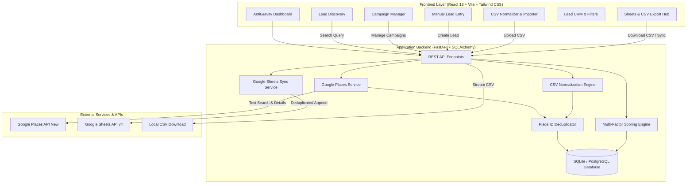

# 🌌 AntiGravity — B2B Lead Finder, Campaign Manager & Google Sheets Sync

[](https://www.python.org/)
[](https://fastapi.tiangolo.com)
[](https://reactjs.org/)
[](https://www.typescriptlang.org/)
[](https://vitejs.dev/)
[](https://tailwindcss.com/)
[](https://www.sqlalchemy.org/)
[](https://opensource.org/licenses/MIT)

> **AntiGravity is an enterprise-grade B2B client acquisition system that discovers high-intent commercial prospects across global markets, groups them into structured campaigns, exports clean CSVs, and synchronizes seamlessly with Google Sheets.**

---

## 📑 Table of Contents

- [🌟 Project Overview](#-project-overview)
- [⚡ Core Capabilities](#-core-capabilities)
- [🏗 System Architecture](#-system-architecture)
- [🛠 Tech Stack](#-tech-stack)
- [📦 Prerequisites](#-prerequisites)
- [🚀 Quick Start](#-quick-start)
- [🐳 Docker Deployment](#-docker-deployment)
- [⚙️ Configuration](#️-configuration)
- [📡 API Reference](#-api-reference)
- [🔄 Core Workflow](#-core-workflow)
- [🧪 Testing & Verification](#-testing--verification)
- [🛡 Security & Compliance](#-security--compliance)
- [📄 License](#-license)

---

## 🌟 Project Overview

Traditional B2B prospecting relies on expensive data subscriptions, messy manual copy-pasting, and brittle spreadsheets. **AntiGravity** replaces this fragmented process with an owned, streamlined lead generation and campaign workflow powered by official Google Places APIs, deterministic deduplication, and bi-directional Google Sheets integration.

- **Discovers verified businesses worldwide** by querying the Google Places API (New) across granular geographic zones and sub-districts.
- **Eliminates duplicates deterministically** using unique Google Place IDs and multi-attribute composite keys.
- **Calculates transparent lead scores (0–100)** to triage prospect readiness based on contact completeness, operational stability, and review signals.
- **Organizes prospects into targeted campaigns** categorized by industry vertical, geographic market, or pipeline stage.
- **Enables instant CSV downloads** with one click across individual campaigns or the entire global lead database.
- **Synchronizes data bi-directionally** with Google Sheets with automatic tab generation, place deduplication, and KPI summaries.
- **Imports external CSV spreadsheets** through fuzzy column mapping, phone/email sanitation, and primary contact extraction.
- **Supports manual lead entry** to add high-touch prospects directly to any campaign with live scoring.

---

## ⚡ Core Capabilities

### 🎯 1. Universal Lead Discovery & Multi-Area Prospecting
- Scans commercial niches (Hostels & PGs, Clinics, Law Firms, Tech Studios, Real Estate) across any city worldwide.
- Executes multi-area sub-district scans (e.g., Koramangala, Indiranagar, HSR Layout) in a single unified operation.
- Applies automated deduplication by Google Place ID to prevent redundant writes and save API quotas.
- Automatically falls back to high-fidelity local simulation when running in sandbox environments without an active billing key.

### 📁 2. B2B Campaign Organization & Pipeline Management
- Group leads into structured campaigns (e.g., "Bangalore Hostels & PGs", "Dubai Luxury Real Estate").
- Track lead outreach status across standard stages: *Not Contacted*, *Contacted*, *Replied*, *Interested*, *Proposal Sent*, *Won*, *Lost*.
- Drill down into campaign-specific leads with instant filters, CRM notes, tags, and follow-up schedules.
- Add prospects manually to any campaign with immediate contact person linkage and dynamic qualification.

### 💾 3. 1-Click CSV File Download & Bulk Export
- Download ready-to-use CSV files directly from the **Campaigns** grid for any individual campaign.
- Export all discovered leads or filtered subsets directly from the **Leads** table or **Exports** hub.
- Exported columns include: Business Name, Contact Name, Category, Address, City, Phone, Website, Email, Google Rating, Review Count, Lead Score, Status, Place ID, Source, Campaign, and Creation Timestamp.
- Compliant RFC 4180 CSV generation handles UTF-8 formatting and special characters safely.

### 📊 4. Native Google Sheets Synchronization
- Direct OAuth 2.0 and Service Account integration with the Google Sheets API (`https://www.googleapis.com/auth/spreadsheets`).
- Pre-checks existing Place IDs in the target worksheet to ensure zero duplicate row insertions.
- Automatically manages dedicated campaign worksheets (e.g., dedicated tabs per campaign).
- Optional automated KPI Dashboard tab summarizing total prospects, review ratings, and priority distribution.
- Logs full export history with direct clickable spreadsheet URLs for auditability.

### 📥 5. Intelligent CSV Importer & Normalization Engine
- Auto-detects custom headers (`Hostel Name`, `Contact Person`, `Email Address`, `Phone`, `City`, `Category`, `Website`).
- Supports RFC-compliant email standards including plus-addressing (`user+tag@domain.com`).
- Extracts primary contact persons into relational records to preserve owner/manager identities.
- Immediately scores, deduplicates, and commits imported records into active campaigns.

---

## 🏗 System Architecture



---

## 🛠 Tech Stack

| Layer | Technologies |
| :--- | :--- |
| **Frontend Framework** | React 18, TypeScript, Vite 5, Tailwind CSS |
| **Icons & UI** | Lucide React, Glassmorphism Slate-950 UI System |
| **Backend Framework** | FastAPI (Python 3.11 / 3.12), Pydantic v2, Uvicorn |
| **Database & ORM** | SQLAlchemy 2.0, SQLite (default) / PostgreSQL (production ready) |
| **External Integrations** | Google Places API (New), Google Sheets API v4 (OAuth 2.0) |
| **Data Processing** | Python CSV Streaming, Fuzzy Column Matching, Regex Data Sanitizers |

---

## 📦 Prerequisites

- **Python**: Version `3.11` or `3.12` installed.
- **Node.js**: Version `18.x` or `20.x` with `npm`.
- **Google Cloud Console Account**: With Places API (New) and Google Sheets API enabled (optional: demo mode available out of the box).

---

## 🚀 Quick Start

### 1. Clone the Repository

```bash
git clone https://github.com/pk1519/campaign.git
cd campaign
```

### 2. Configure Backend Environment

Create `backend/.env` with your settings:

```bash
cd backend
cp .env.example .env
```

Edit `backend/.env`:
```env
GOOGLE_PLACES_API_KEY=AIzaSyYourGooglePlacesKeyHere
GOOGLE_CLIENT_ID=your-google-oauth-client-id.apps.googleusercontent.com
GOOGLE_CLIENT_SECRET=your-google-oauth-client-secret
ENABLE_DEMO_SIMULATION=true
DATABASE_URL=sqlite:///./duo_leads.db
```

### 3. Install Backend Dependencies & Start Server

```bash
python -m venv venv
# Windows:
.\venv\Scripts\activate
# Linux/macOS:
# source venv/bin/activate

pip install -r requirements.txt
uvicorn app.main:app --port 8000 --reload
```

*The API is now running at `http://127.0.0.1:8000` (Swagger docs: `http://127.0.0.1:8000/docs`).*

### 4. Install Frontend Dependencies & Start App

In a separate terminal:

```bash
cd frontend
npm install
npm run dev
```

*The frontend application is now running at `http://127.0.0.1:5173`.*

---

## 🐳 Docker Deployment

Run the complete AntiGravity stack using Docker Compose:

```bash
# Build and run containers in detached mode
docker-compose up -d --build

# View real-time logs
docker-compose logs -f

# Shut down stack
docker-compose down
```

---

## ⚙️ Configuration

| Variable | Default | Description |
| :--- | :--- | :--- |
| `GOOGLE_PLACES_API_KEY` | `""` | Google Cloud API key restricted to Places API (New) |
| `GOOGLE_CLIENT_ID` | `""` | OAuth 2.0 Client ID for Google Sheets authorization |
| `GOOGLE_CLIENT_SECRET` | `""` | OAuth 2.0 Client Secret for Google Sheets authorization |
| `ENABLE_DEMO_SIMULATION`| `true` | Falls back to realistic lead generation if Places key is empty |
| `DATABASE_URL` | `sqlite:///./duo_leads.db` | Database connection string (SQLite or PostgreSQL) |
| `MAX_AREAS_PER_SEARCH` | `10` | Safety limit on sub-areas evaluated per search |
| `MAX_RESULTS_PER_SEARCH`| `60` | Maximum businesses retrieved per single query execution |
| `VITE_API_URL` (Frontend) | `""` (proxied) | Production backend URL when deploying frontend on Vercel |

---

## 📡 API Reference

### 🔍 Lead Discovery
- `POST /api/search` — Discover commercial leads by category, city, country, and sub-areas.
- `GET /api/search/history` — Retrieve previous discovery execution logs and metadata.

### 👥 Leads & CRM
- `GET /api/leads` — Query paginated leads with campaign, priority, and text search filters.
- `POST /api/leads` — Add a lead manually with contact person and instant scoring.
- `PATCH /api/leads/{id}/crm` — Update lead priority, outreach status, follow-up date, and rep notes.
- `POST /api/leads/export/csv` — Stream RFC-compliant CSV containing selected or all leads.
- `POST /api/leads/import/detect-columns` — Upload CSV to auto-detect and preview column mappings.
- `POST /api/leads/import` — Import and score leads from confirmed CSV mappings.
- `DELETE /api/leads/{id}` — Permanently remove a lead from the database.

### 📁 Campaigns
- `GET /api/campaigns` — List all active lead generation campaigns with lead counts.
- `POST /api/campaigns` — Create a new B2B lead campaign.
- `GET /api/campaigns/{id}` — Get single campaign details and parameters.
- `DELETE /api/campaigns/{id}` — Delete a campaign and its lead associations.

### 📊 Google Sheets Sync
- `GET /api/sheets/status` — Check server-side Google Sheets OAuth connection state.
- `POST /api/sheets/connect-demo` — Enable instant local demo connection for spreadsheet testing.
- `POST /api/sheets/export` — Sync campaign leads to Google Sheets with Place ID deduplication.
- `GET /api/sheets/destinations` — Retrieve history of all synchronized spreadsheets.

### ⚙️ System Settings
- `GET /api/settings` — Get current system settings and masked API key status.
- `POST /api/settings` — Update API keys, limits, and simulation preferences.
- `POST /api/settings/reset-data` — Wipe all leads, campaigns, and search history to start fresh.

---

## 🔄 Core Workflow

```
1. Discover Leads (Lead Finder) ──► 2. Score & Deduplicate (0-100) ──► 3. Organize in Campaign
             ▲                                                                    │
             │                                                                    ▼
4. Upload CSV / Manual Entry ────────────────────────────────────────► 5. Export Data
                                                                          ├── Download CSV
                                                                          └── Sync to Google Sheets
```

1. **Lead Discovery**: Enter your business niche (e.g., *"Hostels & PGs"*) and target city (*"Bangalore"*). The system scans sub-districts using Google Places API (New).
2. **Deterministic Deduplication**: Place IDs ensure identical businesses are never duplicated in the database.
3. **Transparent Scoring**: Prospects receive a 0–100 score based on operational status, contact availability, ratings, and web presence.
4. **Campaign Grouping**: Leads are structured into dedicated campaigns for targeted tracking.
5. **Instant Export**:
   - Click **Download CSV** on any campaign or lead view for offline analysis or spreadsheet work.
   - Click **Sync to Google Sheets** to push deduplicated leads directly into a live Google Spreadsheet.

---

## 🧪 Testing & Verification

Run the automated verification suite to validate lead discovery, scoring, and CSV generation:

```bash
# Run backend test suite
cd backend
..\venv\Scripts\python.exe -m pytest -v

# Test CSV export endpoint
..\venv\Scripts\python.exe -c "import requests; r = requests.post('http://127.0.0.1:8000/api/leads/export/csv', json={}); print('Status:', r.status_code, 'Bytes:', len(r.text))"

# Verify frontend production build
cd ../frontend
cmd /c npm run build
```

---

## 🛡 Security & Compliance

- **Backend-Only Secrets**: All Google API keys and OAuth secrets remain strictly on the backend and are never sent to the browser.
- **Git-Ignored Credentials**: `.env`, `duo_leads.db`, token files, and `secrets/` folders are strictly excluded in `.gitignore`.
- **Deduplication Safeguards**: Place ID verification prevents redundant writes and ensures idempotency across Google Sheets exports.
- **Audit Logging**: Every lead import, export, and campaign action is permanently recorded in the `audit_logs` database table.

---

## 📄 License

Distributed under the **MIT License**. See `LICENSE` for more information.

---

**Built by Priyanshu / AntiGravity**
