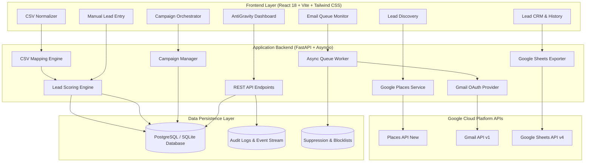

# 🌌 AntiGravity — Autonomous B2B Lead Discovery & Outreach OS

[](https://www.python.org/)
[](https://fastapi.tiangolo.com)
[](https://reactjs.org/)
[](https://www.typescriptlang.org/)
[](https://vitejs.dev/)
[](https://tailwindcss.com/)
[](https://www.sqlalchemy.org/)
[](https://opensource.org/licenses/MIT)

> **AntiGravity is an enterprise-grade autonomous B2B client acquisition and outreach system that discovers high-intent commercial prospects across any global market, scores them dynamically, and dispatches personalized email campaigns with background queue throttling.**

---

## 📑 Table of Contents

- [🌟 Project Overview](#-project-overview)
- [⚡ Core Capabilities](#-core-capabilities)
- [🏗 System Architecture](#-system-architecture)
- [🛠 Tech Stack](#-tech-stack)
- [📦 Prerequisites](#-prerequisites)
- [🚀 Quick Start](#-quick-start)
- [🐳 Docker Deployment](#-docker-deployment)
- [⚙️ Configuration](#️-configuration)
- [📡 API Reference](#-api-reference)
- [🔄 Core Workflow](#-core-workflow)
- [🧪 Testing & Verification](#-testing--verification)
- [🛡 Security & Compliance](#-security--compliance)
- [📄 License](#-license)

---

## 🌟 Project Overview

Traditional B2B lead generation relies on fragmented SaaS subscriptions, brittle web scrapers, and black-box email deliverability services. **AntiGravity** replaces this disjointed stack with an owned, end-to-end client prospecting and cold email pipeline powered by official Google APIs and an event-driven background task manager.

- **Discovers verified businesses worldwide** by querying the Google Places API (New) across granular geographic zones and sub-districts.
- **Eliminates duplicates deterministically** using unique Google Place IDs and SHA-256 multi-attribute composite hashes.
- **Calculates transparent lead scores (0–100)** to triage prospect readiness based on contact completeness, operational stability, and review signals.
- **Normalizes external CSV spreadsheets** through fuzzy column detection, regex phone/email sanitation, and primary contact extraction.
- **Enables instant manual lead entries** into any target campaign directly from the CRM interface with live scoring and contact linking.
- **Dispatches throttled email campaigns** via official Gmail OAuth 2.0 with dynamic placeholder tokenization, suppression protection, and asynchronous pause/resume controls.
- **Synchronizes data bi-directionally** with Google Sheets for zero-friction CRM reporting and operational handoff.

---

## ⚡ Core Capabilities

### 🎯 1. Universal Lead Discovery & Multi-Area Prospecting
- Scans commercial niches (Hostels & PGs, Clinics, Law Firms, Tech Studios, Real Estate) across any city worldwide.
- Executes multi-area sub-district scans (e.g., Koramangala, Indiranagar, HSR Layout) in a single unified operation.
- Applies automated deduplication by Google Place ID to prevent re-querying and save API quotas.
- Automatically falls back to high-fidelity local simulation when running in sandbox environments without an active billing key.

### 🧮 2. Objective Multi-Factor Lead Scoring (0–100)
- **High Intent (70–100)**: Operational status confirmed, verified telephone, live web domain, complete address, and positive review density.
- **Medium Intent (40–69)**: Verified address and telephone, but missing independent website or low review density.
- **Low Intent (0–39)**: Incomplete profile requiring manual research before outbound investment.
- Generates transparent, auditable score reasons stored in JSON format for clear pipeline visibility.

### 📁 3. Intelligent CSV Importer & Normalization Engine
- Auto-detects custom headers (`Hostel Name`, `Contact Person`, `Email Address`, `Phone`, `City`, `Category`, `Website`).
- Supports RFC-compliant email standards including Gmail plus-addressing (`user+tag@domain.com`).
- Extracts primary contact persons into a relational `lead_contacts` table to power personalized email salutations.
- Provides a 1-click transition from CSV completion directly into campaign queue staging.

### ✍️ 4. Manual Lead Entry & Campaign Allocation
- Allows on-the-fly addition of individual high-touch prospects from the **Leads** or **Campaigns** views.
- Automatically links contact person records (`name`, `first_name`) to enable immediate dynamic rendering.
- Dynamically assigns newly created prospects to active campaigns and increments pending queue counters.
- Computes real-time lead score ratings and CRM outreach states upon submission.

### 📬 5. Throttled Gmail Outreach Engine & Token Templating
- Uses official Google OAuth 2.0 (`https://www.googleapis.com/auth/gmail.send`) — **zero SMTP passwords or third-party relay risk**.
- Renders dynamic token placeholders: `{{name}}`, `{{first_name}}`, `{{company}}`, `{{city}}`, `{{category}}`, `{{phone}}`, `{{website}}`.
- Runs preflight validations to filter suppressed addresses, duplicate entries, and malformed emails prior to queue dispatch.
- Features a rate-throttled queue worker (1–60 emails/min) with live background pause, resume, and cancellation controls.
- Enables single-recipient test email previews to verify formatting and variable rendering before public distribution.

---

## 🏗 System Architecture



---

## 🛠 Tech Stack

| Layer | Technologies | Purpose |
|---|---|---|
| **Frontend UI** | React 18, TypeScript, Vite, Tailwind CSS, Lucide Icons | Responsive client dashboard & live queue monitors |
| **Backend API** | Python 3.11+, FastAPI, Pydantic v2, Uvicorn, Asyncio | High-performance asynchronous REST API & queue workers |
| **Database & ORM** | SQLAlchemy 2.0, Alembic, SQLite (dev) / PostgreSQL 14+ (prod) | Relational CRM models, foreign key cascading, and migrations |
| **Google Cloud APIs** | Google Places API (New), Gmail API (v1), Google Sheets API (v4) | Commercial place discovery, outbound email, and spreadsheet export |
| **Authentication** | Google OAuth 2.0 (`google-auth-oauthlib`, `google-api-python-client`) | Secure, passwordless Gmail authorization |
| **DevOps & Containers**| Docker, Docker Compose, Vercel | Production containerization and edge frontend deployment |

---

## 📦 Prerequisites

Ensure the following tools are installed on your system:

| Dependency | Minimum Version | Recommended Version |
|---|---|---|
| **Python** | `3.11.0` | `3.12.x` |
| **Node.js** | `v18.0.0` | `v20.x LTS` |
| **Package Manager**| `npm 9.x` (or `pnpm 8+`) | `npm 10.x` |
| **Git** | `2.38.0` | Latest |

---

## 🚀 Quick Start

### 1. Clone & Configure Environment

```bash
# Clone the repository
git clone https://github.com/pk1519/OutreachOS.git
cd OutreachOS

# Create environment file from template
cp .env.example .env
```

*(On Windows PowerShell: `Copy-Item .env.example .env`)*

Configure your `.env` parameters:
```env
GOOGLE_PLACES_API_KEY=AIzaSy...your_google_places_api_key
GOOGLE_CLIENT_ID=your_oauth_client_id.apps.googleusercontent.com
GOOGLE_CLIENT_SECRET=your_oauth_client_secret
DATABASE_URL=sqlite:///./duo_leads.db
FRONTEND_URL=http://localhost:5173
```

---

### 2. Launch the Backend API (FastAPI)

```bash
# Create and activate Python virtual environment
python -m venv venv

# Windows (PowerShell):
.\venv\Scripts\Activate.ps1

# Linux / macOS:
source venv/bin/activate

# Install backend dependencies
pip install -r backend/requirements.txt

# Start backend server with hot-reload
cd backend
uvicorn app.main:app --reload --host 127.0.0.1 --port 8000
```
- **REST API Health**: [http://127.0.0.1:8000/health](http://127.0.0.1:8000/health)
- **Interactive Swagger Docs**: [http://127.0.0.1:8000/docs](http://127.0.0.1:8000/docs)

---

### 3. Launch the Frontend (React + Vite)

In a separate terminal:
```bash
cd frontend

# Install Node dependencies
npm install

# Start development server
npm run dev
```
- **Web Application Dashboard**: [http://localhost:5173](http://localhost:5173)

---

## 🐳 Docker Deployment

To run the entire ecosystem (PostgreSQL 14, FastAPI Backend, and React Frontend) with persistent volumes:

```bash
# Build and start all services in detached mode
docker-compose up --build -d

# View live container logs
docker-compose logs -f

# Gracefully stop services
docker-compose down
```

| Service | Port | Description |
|---|---|---|
| **Frontend Dashboard** | `http://localhost:3000` | Production React SPA served via Nginx |
| **Backend REST API** | `http://localhost:8000` | FastAPI server running under Uvicorn |
| **PostgreSQL Database** | `localhost:5432` | Relational storage for leads, campaigns, and queues |

---

## ⚙️ Configuration

| Variable | Default Value | Description |
|---|---|---|
| `DATABASE_URL` | `sqlite:///./duo_leads.db` | PostgreSQL connection URI or local SQLite file path |
| `GOOGLE_PLACES_API_KEY` | `""` | GCP API Key with Places API (New) enabled |
| `GOOGLE_CLIENT_ID` | `""` | GCP OAuth 2.0 Web Client ID for Gmail and Sheets |
| `GOOGLE_CLIENT_SECRET` | `""` | GCP OAuth 2.0 Web Client Secret |
| `GOOGLE_REDIRECT_URI` | `http://localhost:8000/api/sheets/oauth-callback` | Registered OAuth redirect endpoint |
| `GMAIL_SENDER_EMAIL` | `contact.devworks7@gmail.com` | Authenticated outbound Gmail sender |
| `FRONTEND_URL` | `http://localhost:5173` | Allowed CORS frontend origin |
| `SECRET_KEY` | `duo-systems-super-secret-production-key-2026` | Cryptographic session and CSRF key |
| `MAX_AREAS_PER_SEARCH` | `15` | Safety ceiling for multi-area batch discovery |
| `MAX_RESULTS_PER_SEARCH`| `100` | Maximum leads stored per discovery operation |
| `ENABLE_DEMO_SIMULATION`| `true` | Enables high-fidelity simulation if no API key is supplied |

---

## 📡 API Reference

### 🔍 Discovery & Searches
| Method | Endpoint | Description |
|---|---|---|
| `POST` | `/api/search` | Execute multi-area search via Google Places API (New) with Place ID deduplication. |
| `GET` | `/api/search/history` | Retrieve historical search logs with result and duplicate counters. |

### 👥 Leads & CRM Management
| Method | Endpoint | Description |
|---|---|---|
| `GET` | `/api/leads` | Filter, paginate, and search leads by campaign, score, and contact status. |
| `POST` | `/api/leads` | **Manually create a new lead** with instant scoring and campaign linkage. |
| `POST` | `/api/leads/import/detect-columns` | Upload CSV and automatically detect matching column headers. |
| `POST` | `/api/leads/import` | Ingest CSV records with deduplication, contact extraction, and scoring. |
| `GET` | `/api/leads/{id}` | Fetch granular lead record, contact details, notes, and outreach logs. |
| `PATCH` | `/api/leads/{id}` | Update lead fields, business status, website, or campaign affiliation. |
| `PATCH` | `/api/leads/{id}/crm` | Update lead CRM pipeline status (`Not Contacted`, `Contacted`, `Replied`, `Converted`). |
| `DELETE`| `/api/leads/{id}` | Delete a lead and cascade orphan associations. |

### 🚀 Outreach & Campaigns
| Method | Endpoint | Description |
|---|---|---|
| `GET` | `/api/campaigns` | List all campaigns with real-time recipient and progress counters. |
| `POST` | `/api/campaigns` | Create a campaign with personalized subject and body templates. |
| `POST` | `/api/campaigns/preflight-validate` | Validate lead email formats, check duplicates, and filter suppression lists. |
| `POST` | `/api/campaigns/{id}/prepare` | Lock recipients and configure dispatch rate for sending. |
| `POST` | `/api/campaigns/{id}/test-email` | Dispatch a rendered test preview strictly to a verified test address. |
| `POST` | `/api/campaigns/{id}/send` | Launch the asynchronous throttled email queue worker. |
| `POST` | `/api/campaigns/{id}/pause` | Pause a running queue dispatch. |
| `POST` | `/api/campaigns/{id}/resume` | Resume a paused queue worker. |
| `POST` | `/api/campaigns/{id}/cancel` | Abort a campaign and purge pending queue jobs. |

### 📊 Queue, Metrics & Database Admin
| Method | Endpoint | Description |
|---|---|---|
| `GET` | `/api/email-queue` | Real-time queue snapshot (pending, processing, sent, failed, skipped). |
| `GET` | `/api/email-history` | Searchable log of dispatched messages with Gmail Message IDs. |
| `GET` | `/api/dashboard` | High-level metrics for leads, campaigns, conversion rates, and queue health. |
| `POST` | `/api/settings/reset-data` | **Safe data reset endpoint**: wipes leads and campaigns while preserving OAuth credentials. |

---

## 🔄 Core Workflow

```text
  [1. Discover or Import]
         │
         ├──► Places API Discovery ──────┐
         ├──► CSV Spreadsheet Upload ───┼──► [2. Normalize & Score (0–100)]
         └──► Manual Lead Form ──────────┘                 │
                                                           ▼
  [5. Completed & Logged] ◄── [4. Throttled Queue] ◄── [3. Template & Validate]
```

1. **Ingest Prospects**: Discover leads through Google Places API, import external CSVs with fuzzy column detection, or manually enter high-priority leads.
2. **Normalize & Score**: Automatic deduplication (by Google Place ID or email) and objective scoring (0–100) based on operational metrics.
3. **Template & Preflight**: Draft personalized templates with dynamic tokens (`{{name}}`, `{{company}}`, `{{city}}`, `{{category}}`) and run preflight safety checks.
4. **Throttled Dispatch**: Background worker sends personalized messages via Gmail OAuth with rate limiting (e.g. 10/min) and exponential backoff retry.
5. **Track & Sync**: Results are logged in Email History with Gmail message IDs and synced to Google Sheets for client CRM tracking.

---

## 🧪 Testing & Verification

Run the comprehensive end-to-end test suite:

```bash
# Run pytest unit and integration tests
pytest -v

# Run targeted CSV import, scoring, and queue verification script
python backend/test_csv_and_campaign.py

# Verify frontend TypeScript types and Vite production build
cd frontend
npm run build
```

---

## 🛡 Security & Compliance

- **Zero Stored Passwords**: Communicates strictly via short-lived OAuth 2.0 access tokens refreshed directly via Google servers (`auth/gmail.send`).
- **Complete Secret Isolation**: Environment variables, local database files (`*.db`), and OAuth token files (`credentials.json`) are strictly git-ignored.
- **Suppression Protection**: Preflight validations automatically screen out unsubscribed or blocked emails before queuing.
- **Comprehensive Audit Trail**: Every lead creation, campaign lifecycle event, and settings modification is recorded in the `audit_logs` table.

---

## 📄 License

Distributed under the **MIT License**. See [`LICENSE`](LICENSE) for complete terms.

---

<p align="center">
  <b>Built by Priyanshu — Duo Systems Technical Automation Studio</b>
</p>
