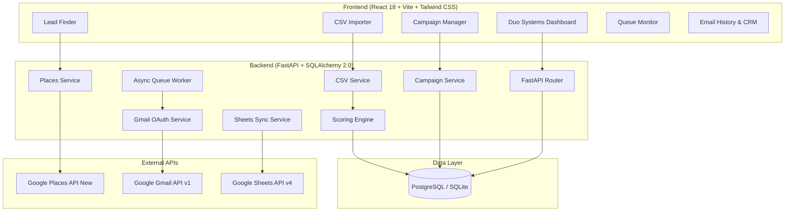

# 🚀 OutreachOS — Lead Finder & Outreach Center

[](https://fastapi.tiangolo.com)
[](https://reactjs.org/)
[](https://www.typescriptlang.org/)
[](https://vitejs.dev/)
[](https://tailwindcss.com/)
[](https://www.python.org/)
[](https://www.sqlalchemy.org/)
[](https://opensource.org/licenses/MIT)

> **A production-grade, full-stack B2B client acquisition, automated qualification, CSV lead management, and Gmail outreach platform built for technical studios, agencies, and B2B growth teams.**

---

## 📑 Table of Contents

1. [Platform Overview](#-platform-overview)
2. [Core Capabilities](#-core-capabilities)
3. [System Architecture](#-system-architecture)
4. [Tech Stack](#-tech-stack)
5. [Prerequisites](#-prerequisites)
6. [Quick Start (Local Development)](#-quick-start-local-development)
7. [Docker Deployment](#-docker-deployment)
8. [Configuration & Environment Variables](#-configuration--environment-variables)
9. [Google Cloud Setup (Places API & Gmail OAuth)](#-google-cloud-setup)
10. [REST API Reference](#-rest-api-reference)
11. [Outreach Pipeline & CSV Import Workflow](#-outreach-pipeline--csv-import-workflow)
12. [Testing & Verification](#-testing--verification)
13. [Security & Compliance](#-security--compliance)
14. [License](#-license)

---

## 🌟 Platform Overview

**Duo Systems Lead Finder & Outreach Center** unifies prospective business client discovery with an automated qualification engine and an asynchronous, rate-limited email outreach system.

Instead of paying exorbitant monthly subscriptions for fragmented prospecting tools, scraping bots, and email warmers, Duo Systems provides an all-in-one owned platform that:
- **Discovers high-intent business leads worldwide** via the official Google Places API (New).
- **Eliminates duplicates** using deterministic Google Place IDs and multi-attribute hashing.
- **Scores every lead objectively (0–100)** based on operational health, website availability, phone verification, and reviews.
- **Imports external CSV spreadsheets** with intelligent header detection and flexible column mapping.
- **Dispatches personalized email campaigns** through official Gmail OAuth 2.0 with background queue throttling, exponential backoff, preflight validation, and suppression checking.
- **Syncs with Google Sheets** for real-time CRM reporting and team collaboration.

---

## ⚡ Core Capabilities

### 🔍 1. Universal Lead Finder
- Target any business vertical (Hostels & PGs, Clinics, Restaurants, IT Agencies, Real Estate, etc.) in any city worldwide.
- Multi-area sub-district scanning (e.g., Koramangala, Indiranagar, HSR Layout).
- Real-time fallback simulation when running in sandbox/demo environments.

### 📊 2. Transparent Lead Scoring (0–100)
- **High Intent (70–100)**: Fully verified contact details, operational business, active reviews, and digital presence.
- **Medium Intent (40–69)**: Verified phone/address with missing website or low review density.
- **Low Intent (0–39)**: Incomplete business profiles requiring manual verification.
- Every score includes auditable rationale and prioritized outreach badges.

### 📁 3. Smart CSV Importer
- Drag-and-drop CSV lead spreadsheets from Apollo, LinkedIn Sales Navigator, or proprietary lists.
- **Automatic Column Detection**: Fuzzy matches columns (`Hostel Name`, `Contact Person`, `Email Address`, `Phone`, `City`, `Category`, `Website`).
- Supports RFC-standard email addresses including plus-tags (`user+tag@example.com`).
- Direct 1-click transition: `Upload CSV` ➔ `Review Mappings` ➔ `Launch Campaign`.

### 📬 4. Gmail Outreach Center
- Official Google OAuth 2.0 (`https://www.googleapis.com/auth/gmail.send`) — **Zero SMTP passwords or scraping bots**.
- **Dynamic Template Engine**: Render personalized tokens like `{{name}}`, `{{first_name}}`, `{{company}}`, `{{city}}`, `{{category}}`, `{{phone}}`, `{{website}}`.
- **Preflight Safety Validation**: Scans for invalid emails, duplicates, and suppressed recipients before queuing.
- **Single-Recipient Test Send**: Safely test live email renderings to `contact.devworks7@gmail.com` before full release.
- **Throttled Queue Worker**: Configurable dispatch rates (1–60 emails/min) with background pause, resume, and cancellation controls.
- **Suppression Management**: Unsubscribe and suppression list filtering to preserve sender reputation.

---

## 🏗 System Architecture



---

## 🛠 Tech Stack

| Layer | Technologies |
|---|---|
| **Frontend** | React 18, TypeScript, Vite, Tailwind CSS, Lucide Icons |
| **Backend** | Python 3.11+, FastAPI, Pydantic v2, Uvicorn, Asyncio |
| **Database & ORM** | SQLAlchemy 2.0, Alembic, PostgreSQL 14+ (or local SQLite) |
| **Google APIs** | Google Places API (New), Gmail API (v1), Google Sheets API (v4) |
| **Authentication** | Google OAuth 2.0 (`google-auth-oauthlib`, `google-api-python-client`) |
| **Containerization** | Docker, Docker Compose |

---

## 📦 Prerequisites

Before running the application, ensure you have:
- **Python**: `3.11` or `3.12`
- **Node.js**: `v18.0.0` or later (`v20+` recommended)
- **Package Manager**: `npm` (or `pnpm` / `yarn`)
- **Git**

---

## 🚀 Quick Start (Local Development)

### 1. Clone the Repository
```bash
git clone https://github.com/pk1519/campaign.git
cd campaign
```

### 2. Configure Environment Variables
Copy the template configuration file:
```bash
cp .env.example .env
```
*(Windows PowerShell: `Copy-Item .env.example .env`)*

Configure your settings in `.env`:
```env
GOOGLE_PLACES_API_KEY=AIzaSy...your_key_here
GOOGLE_CLIENT_ID=your_google_oauth_client_id
GOOGLE_CLIENT_SECRET=your_google_oauth_client_secret
DATABASE_URL=sqlite:///./duo_leads.db
FRONTEND_URL=http://localhost:5173
```

---

### 3. Start the Backend (FastAPI)

```bash
# Create and activate virtual environment
python -m venv venv

# Windows (PowerShell):
.\venv\Scripts\Activate.ps1

# Linux / macOS:
source venv/bin/activate

# Install dependencies
pip install -r backend/requirements.txt

# Run backend development server
cd backend
uvicorn app.main:app --reload --host 127.0.0.1 --port 8000
```
- **Backend API**: [http://127.0.0.1:8000](http://127.0.0.1:8000)
- **Interactive OpenAPI Docs**: [http://127.0.0.1:8000/docs](http://127.0.0.1:8000/docs)

---

### 4. Start the Frontend (React + Vite)

In a new terminal window:
```bash
cd frontend

# Install packages
npm install

# Start Vite dev server
npm run dev
```
- **Frontend Dashboard**: [http://localhost:5173](http://localhost:5173)

---

## 🐳 Docker Deployment

To launch the full stack (PostgreSQL, FastAPI Backend, and React Frontend) with a single command:

```bash
docker-compose up --build -d
```

Services will be accessible at:
- **Frontend App**: `http://localhost:3000`
- **Backend REST API**: `http://localhost:8000`
- **PostgreSQL Database**: `localhost:5432`

To shut down:
```bash
docker-compose down
```

---

## ⚙️ Configuration & Environment Variables

| Variable | Default Value | Description |
|---|---|---|
| `DATABASE_URL` | `sqlite:///./duo_leads.db` | PostgreSQL connection string or SQLite local file |
| `GOOGLE_PLACES_API_KEY` | `""` | Google Cloud API key with Places API (New) enabled |
| `GOOGLE_CLIENT_ID` | `""` | OAuth 2.0 Web Client ID for Gmail & Sheets |
| `GOOGLE_CLIENT_SECRET` | `""` | OAuth 2.0 Client Secret |
| `GOOGLE_REDIRECT_URI` | `http://localhost:8000/api/sheets/oauth-callback` | OAuth redirect URI configured in GCP |
| `GMAIL_SENDER_EMAIL` | `contact.devworks7@gmail.com` | Verified sending Gmail account |
| `FRONTEND_URL` | `http://localhost:5173` | Allowed CORS frontend origin |
| `SECRET_KEY` | `duo-systems-super-secret-production-key-2026` | App session encryption key |
| `MAX_AREAS_PER_SEARCH` | `15` | Maximum sub-areas permitted in a single search |
| `MAX_RESULTS_PER_SEARCH` | `100` | Results ceiling per discovery execution |
| `ENABLE_DEMO_SIMULATION`| `true` | Allows realistic mock fallback if API key is not supplied |

---

## 🔑 Google Cloud Setup

1. **Create Project**: Go to [Google Cloud Console](https://console.cloud.google.com/) and create a project (e.g., `Duo Systems Lead Finder`).
2. **Enable APIs**:
   - `Places API (New)`
   - `Gmail API`
   - `Google Sheets API`
   - `Google Drive API`
3. **Configure OAuth Consent Screen**:
   - User Type: **External**
   - App Name: `Duo Systems Lead Finder`
   - Scopes:
     - `https://www.googleapis.com/auth/gmail.send`
     - `https://www.googleapis.com/auth/spreadsheets`
     - `https://www.googleapis.com/auth/drive.file`
   - Add Test Users (e.g. `contact.devworks7@gmail.com`).
4. **Create OAuth 2.0 Web Client**:
   - Authorized JavaScript Origins: `http://localhost:5173`, `http://127.0.0.1:5173`
   - Authorized Redirect URIs:
     - `http://localhost:8000/api/integrations/gmail/callback`
     - `http://localhost:8000/api/sheets/oauth-callback`
5. Place downloaded credentials as `backend/secrets/google/credentials.json` or populate `GOOGLE_CLIENT_ID` and `GOOGLE_CLIENT_SECRET` in `.env`.

---

## 📡 REST API Reference

### 🔍 Search & Lead Discovery
- `POST /api/search`: Discover leads with automated Place ID deduplication, scoring, and campaign association.
- `GET /api/search/history`: Retrieve paginated search history records.

### 👥 Leads & CRM Management
- `GET /api/leads`: Search, filter, and paginate leads by campaign, score, and contact status.
- `POST /api/leads/import/detect-columns`: Parse uploaded CSV and propose automatic field mappings.
- `POST /api/leads/import`: Import leads with deduplication, contact person extraction, and scoring.
- `PATCH /api/leads/{id}`: Update lead CRM status, notes, tags, and contact details.
- `DELETE /api/leads/{id}`: Remove lead record.

### 🚀 Outreach & Campaigns
- `GET /api/campaigns`: List all outreach campaigns and progress metrics.
- `POST /api/campaigns`: Create campaign with personalized subject & body templates.
- `POST /api/campaigns/preflight-validate`: Validate lead emails against regex, duplicates, and suppression lists.
- `POST /api/campaigns/{id}/prepare`: Prepare recipients and lock in templates.
- `POST /api/campaigns/{id}/test-email`: Send a safe rendered test email to verified test inbox.
- `POST /api/campaigns/{id}/send`: Launch asynchronous background queue sending worker.
- `POST /api/campaigns/{id}/pause`: Pause active sending queue.
- `POST /api/campaigns/{id}/resume`: Resume paused queue.
- `POST /api/campaigns/{id}/cancel`: Stop queue execution.

### 📊 Queue, History & Analytics
- `GET /api/email-queue`: Real-time queue monitor (pending, processing, sent, failed, skipped).
- `GET /api/email-history`: Searchable history of all sent messages with Gmail message IDs and body snippets.
- `GET /api/dashboard`: Aggregated pipeline analytics, qualified counts, and conversion funnel data.
- `POST /api/settings/reset-data`: Safe 1-click database wipe to reset leads and campaigns to clean state.

---

## 🔄 Outreach Pipeline & CSV Import Workflow

```text
[1. Upload CSV] ─────► [2. Column Auto-Detect] ─────► [3. Import & Score Leads]
                                                               │
                                                               ▼
[6. Sent & Logged] ◄── [5. Launch Throttled Queue] ◄── [4. Template & Preflight]
```

1. **Upload Spreadsheet**: Accepts `.csv` files with contact names, company names, emails, phones, and locations.
2. **Auto-Mapping**: System maps column headers (`Contact Name` &rarr; `contact_name`, `Hostel Name` &rarr; `business_name`, `Email Address` &rarr; `email`).
3. **Qualification**: Leads are scored `0–100` and attached to the target campaign.
4. **Personalize Message**:
   ```text
   Hi {{name}},

   I came across {{company}} in {{city}} and wanted to reach out regarding our automated booking system for {{category}} accommodations...
   ```
5. **Preflight Validation**: Validates recipients, filters suppression list, and sends test preview.
6. **Launch Campaign**: The background worker sends emails with rate-limiting (e.g. 10/min) and logs results to Email History.

---

## 🧪 Testing & Verification

Run backend integration test suite:

```bash
# Run all pytest suites
pytest -v

# Run targeted outreach & CSV pipeline tests
python backend/test_csv_and_campaign.py
```

Frontend production build check:
```bash
cd frontend
npm run build
```

---

## 🛡 Security & Compliance

- **No Stored Passwords**: Outbound emails strictly use short-lived OAuth 2.0 access tokens refreshed via Google servers.
- **Git-Ignored Secrets**: All `.env`, `credentials.json`, `token.json`, and database files are excluded from version control.
- **Suppression Protection**: Prevents reaching out to opt-out or blocked recipients.
- **Auditing**: Every critical administrative action (campaign creation, deletion, imports, credential changes) is logged to the `audit_logs` table.

---

## 📄 License

Distributed under the **MIT License**. See `LICENSE` for more details.

---

<p align="center">
  <b>Built by Duo Systems — Technical Automation Studio</b>
</p>
