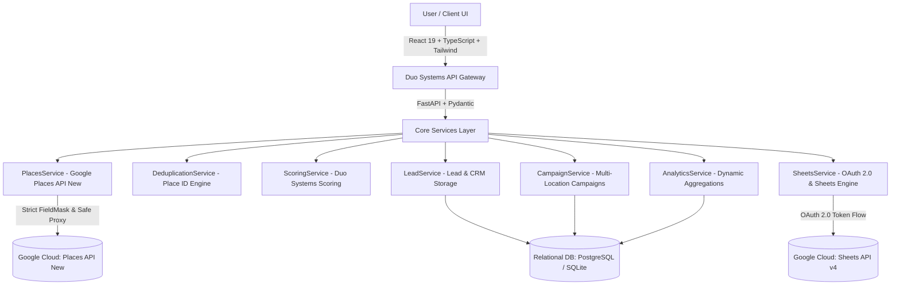

# System Architecture - DUO SYSTEMS LEAD FINDER

## 1. High-Level Architecture Overview

**DUO SYSTEMS LEAD FINDER** is a production-grade B2B lead discovery, qualification, scoring, and Google Sheets CRM export platform. It is engineered with strict separation of concerns, zero hardcoded assumptions regarding geography or business type, and complete adherence to Google Maps Platform policies.

## 2. Core Principles & Policies

1. **Universal Category & Location Freedom**:
   - The platform never hardcodes Bangalore, India, Gyms, or any single industry.
   - Any query supported by Google Places API (New) Text Search (`/v1/places:searchText`) is supported.

2. **Deduplication Engine**:
   - Unique identifier: Google **Place ID** (`places.id`).
   - When running multi-area campaigns (e.g. Koramangala + Indiranagar + HSR Layout), results are merged deterministically.
   - The system tracks: `Raw Results Found`, `Unique Leads`, `Duplicates Removed`.

3. **Separation of Google Data vs. Duo Systems CRM Data**:
   - **Google-Derived Information**: Business Name, Formatted Address, Verified Phone, Website URI, Rating, User Rating Count, Business Status, Place ID, Google Maps URI.
   - **Duo Systems CRM Information**: Duo Lead Score, Lead Priority, Campaign Association, Outreach Status, Follow-up Dates, Last Contacted Timestamps, B2B Pitch Drafts, Rep Notes.

4. **Security & Credential Isolation**:
   - API keys and OAuth tokens are strictly server-side.
   - The frontend never connects directly to Google Places API.
   - Token refresh occurs server-side without transmitting credentials to the browser.
