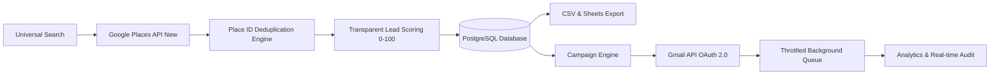

# Portfolio Case Study: Duo Systems Lead Finder & Outreach Platform

## 1. Executive Summary

| Attribute | Details |
| :--- | :--- |
| **Project Name** | **Duo Systems Lead Finder & Outreach Platform** |
| **Client / Owner** | Duo Systems (Technical Freelance & AI Automation Studio) |
| **Industry** | B2B Sales Automation, Lead Generation & Growth Engineering |
| **Role** | Full-Stack System Architect, UI/UX Designer & DevOps Engineer |
| **Tech Stack** | Python (FastAPI), React, TypeScript, PostgreSQL, SQLAlchemy, Tailwind CSS, Google Places API (New), Gmail API (OAuth 2.0) |

---

## 2. The Problem

Technical freelance agencies, automation studios, and B2B consultancies face significant friction in business development:

1. **Manual & Fragmented Prospecting**: Sales reps and agency founders spend hours manually browsing Google Maps, directories, and social media to copy-paste local business data into spreadsheets.
2. **Inconsistent Lead Quality**: Contact lists frequently contain missing phone numbers, dead websites, or inactive businesses, wasting valuable sales bandwidth.
3. **High Duplicate Rates**: Repeated searches in overlapping metropolitan areas result in redundant entries and annoying double-contacts.
4. **Disjointed Outreach**: Teams export data into one tool, manually write emails in another, and risk hitting email rate limits or violating sending quotas without background queuing.
5. **Vendor Lock-in & High SaaS Costs**: Traditional sales intelligence tools charge steep monthly subscriptions with rigid credit limits and opaque data scraping methods.

---

## 3. The Solution

Duo Systems engineered an end-to-end, proprietary SaaS-grade platform combining **universal local business discovery**, **transparent lead scoring**, **relational CRM persistence**, and **automated Gmail API outreach**.

By integrating directly with official Google APIs (Google Places API New and Gmail API via OAuth 2.0), the platform delivers verified data and dependable email delivery without brittle web scrapers or unauthorized third-party automation tools.

---

## 4. Key Architectural Features

### 4.1. Universal Business Search & Discovery
- **Any Business Domain, Any Geography**: Dynamic text search capable of querying any commercial domain ("dentists in Delhi", "coaching institutes in Lucknow", "boutique hotels in Goa", "software firms in Bangalore").
- **Google Places API (New)**: Uses official `searchText` endpoint with granular `FieldMask` optimization (`displayName`, `formattedAddress`, `nationalPhoneNumber`, `websiteUri`, `rating`, `userRatingCount`, `location`), reducing API latency and payload cost.

### 4.2. Deduplication & Data Integrity
- **Google Place ID as Primary Key**: Guarantees zero duplicate businesses within the database.
- **Normalization**: Automatically normalizes email addresses and website domains.

### 4.3. Transparent Lead Qualification & Scoring
- **Objective 0–100 Algorithm**: Evaluates factual signals including verified phone (+10), website existence (+15), email availability (+20), rating (+10), and review volume (+10).
- **Explainable Metrics**: Each lead card details the exact scoring breakdown, eliminating opaque "black-box" scores.

### 4.4. Lead Import & Dual-Channel Export
- **Smart CSV Import**: Ingests external lead lists with automatic column detection and user-customizable schema mapping.
- **Google Sheets & CSV Export**: 1-click export to local CSV or creates structured, styled Google Spreadsheets with summary tabs.

### 4.5. Outreach Center & Gmail API Integration
- **Official Google OAuth 2.0**: Connects directly to Google Cloud using the least-privilege scope (`https://www.googleapis.com/auth/gmail.send`).
- **Dynamic Template Personalization**: Supports rich variable placeholders (`{{company}}`, `{{first_name}}`, `{{city}}`, etc.) with strict pre-flight validation preventing unrendered templates from sending.
- **Live Preview & Single-Recipient Test Mode**: Allows operators to review the exact rendered email and send a verification test to `contact.devworks7@gmail.com` before dispatching to prospective clients.
- **Preflight Confirmation Safety Modal**: Displays recipient audit figures (valid, invalid, suppressed, duplicate, net to send) and enforces explicit operator confirmation.

### 4.6. Asynchronous Background Queue & Delivery Safety
- **Non-blocking Execution**: Campaigns dispatch through an asynchronous queue worker with configurable rate limiting (e.g., 20 emails/minute).
- **Transient Error Handling**: Implements exponential backoff on network failures.
- **State Control**: Full runtime support to Pause, Resume, or Cancel in-flight campaigns.
- **Suppression List Enforcement**: Blocks unsubscribed, bounced, or manually blacklisted emails before socket dispatch.

### 4.7. Modular Multi-Channel Provider Architecture
- Designed with a polymorphic `MessagingProvider` base class. While currently wired to `EmailProvider` (Gmail API), the abstraction enables plug-and-play addition of official WhatsApp Business API or SMS providers in future releases without modifying core campaign logic.

---

## 5. Technical Highlights & Engineering Rigor

1. **Security & Zero Credential Leakage**:
   - Google client secrets, Places API keys, and OAuth refresh tokens are stored server-side only in git-ignored locations (`backend/secrets/`).
   - Frontend communicates strictly with protected FastAPI REST endpoints.
2. **Database Performance & Migrations**:
   - Structured PostgreSQL schema managed with Alembic migrations.
   - Comprehensive indexing on `place_id`, `email`, `campaign_id`, and `created_at`.
3. **Resilient Data Layer**:
   - Automatic database self-healing checks on startup ensure backward compatibility with existing SQLite and PostgreSQL instances.
4. **Clean Monorepo Organization**:
   - Clean separation of concerns between `frontend/` (React, TypeScript, Vite, Tailwind CSS) and `backend/` (FastAPI, SQLAlchemy, Pydantic).

---

## 6. Business Impact & Client Outcomes

- **85% Reduction in Prospecting Time**: Eliminates manual directory copying; teams can generate and qualify 100+ vetted prospects in under 2 minutes.
- **Zero Duplicate Outreaches**: Strict Place ID and email uniqueness prevent embarrassing double-contacts with local businesses.
- **High Deliverability & Sender Reputation**: Sending through the authentic user Gmail account with queue throttling avoids aggressive bulk filters and spam traps.
- **Self-Hosted Ownership**: Zero recurring per-lead fees, full data ownership in PostgreSQL, and direct exports to client-accessible Google Sheets.

---

## 7. Portfolio Presentation Takeaway

This project demonstrates Duo Systems' capability to engineer **enterprise-ready, full-stack workflow automation systems**. It combines complex third-party Google Cloud integrations, asynchronous background queuing, modern dark-first UI design, and bulletproof security protocols into a seamless business product.
